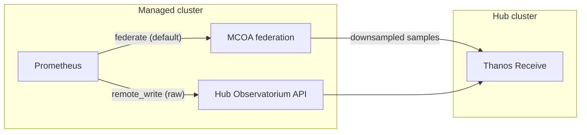

# Keep the 15-second view: raw metrics collection with ACM

**Audience:** Platform engineers who need incident-level resolution from ACM Observability without federating the entire fleet at native scrape cadence.  
**Applies to:** MultiCluster Observability Addon (MCOA) in ACM 5.0. Raw collection is **Technology Preview**. Perses dashboards are generally available.  
**Status:** Draft 5.0

Fleet dashboards that only update every five minutes hide the signal you need during an incident. A CPU throttle, a network micro-burst, or a brief `up` flap never lands in the downsample.

**Summary:** ACM Observability collects metrics from managed clusters with MCOA. The default path is Prometheus federation, downsampled to five minutes. That default is the right choice for fleet scale. When you need the sample that local Prometheus actually scraped, opt a hub `ScrapeConfig` into **raw** collection. The platform or user-workload Prometheus on the managed cluster then remote-writes those series to the hub at native scrape resolution. Federation stays in place for everything else.

> **Important:** Collecting raw metrics with the multicluster observability add-on is a Technology Preview feature. Technology Preview features are not supported with Red Hat production service level agreements (SLAs), might not be functionally complete, and Red Hat does not recommend using them in production.

Enable MCOA first: [MCOA core and configuration](mcoa-core-and-configuration-draft5.0.md).

## When federation is the wrong tool

MCOA collects custom metrics with the Prometheus federation API by default. That path is efficient at fleet scale and is a good fit for overview dashboards.

It is a poor fit when you need samples **more often than about 90 seconds**:

- Frequent federation scrapes use more CPU on the source Prometheus.
- You still lose fidelity compared with the native scrape.
- If the native scrape is coarser than the federation interval (for example, a two-minute scrape federated more often), you can ship duplicate samples into Thanos Receive.

You asked Prometheus to do more work and still did not get the raw series.

## What raw collection changes

Raw collection is opt-in **per `ScrapeConfig`** on the hub cluster. You do not replace MCOA, and you do not send the entire fleet at high resolution.

Set the resolution strategy to `raw` on the configs that matter:

```bash
oc annotate scrapeconfig <scrape-config-name> \
  -n open-cluster-management-observability \
  observability.open-cluster-management.io/resolution-strategy=raw
```

You can also create a dedicated `ScrapeConfig` with the same annotation. The example below shows that path. Prefer Git for the object; keep the annotation in the YAML so a GitOps sync does not strip it. See [Add a ScrapeConfig via Git](add-scrape-config-via-git-draft5.0.md).

What happens next:

1. That config leaves the MCOA federation path.
2. On the managed cluster, the metric selectors become Prometheus `remoteWrite` configuration for Cluster Monitoring Operator (CMO) platform or user-workload Prometheus.
3. Series arrive on the hub at native scrape resolution.
4. Query them in Perses at a **30-second step**. A five-minute step still looks like the federated downsample and will not show the raw path.

Every other `ScrapeConfig` without the annotation stays on the federated, downsampled path.



## What to plan for

Native resolution produces more data points than five-minute federation. Plan for that before you widen what you collect. This is a cardinality-adjacent cost: same series names, many more samples. Fix noisy labels first ([Cardinality](cardinality-draft5.0.md)).

- **Network and Receive.** Expect more bandwidth between managed clusters and the hub, and more CPU and memory on Thanos Receive.
- **High-availability Prometheus doubles ingest.** Two in-cluster Prometheus replicas each stream an independent copy. Thanos Compactor later drops the redundant samples from long-term object storage, but Receive still processes both streams. Size Receive before you enable raw collection on high-cardinality jobs.
- **Storage.** Higher ingest needs more hub write-ahead log (WAL) and receiver block buffer, and more object storage for the raw-resolution blocks.
- **Managed-cluster Prometheus load.** Remote-write is extra work on the source.
- **The right query step in Perses.** If dashboards still use a five-minute step, raw series look as if they never arrived. Use a 30-second step.

## Try it on one diagnostic config

You need cluster-administrator access and MCOA enabled. For user-workload series, enable user-workload monitoring on the managed clusters.

Do not annotate the default platform allowlist the first time you enable raw collection. That allowlist is a large set of fleet metrics. If you switch it to raw, every series in it starts remote-writing at native scrape resolution.

Start with a **small extra** `ScrapeConfig` whose `match[]` list is only the series you need. This example collects API server health:

```yaml
apiVersion: monitoring.rhobs/v1alpha1
kind: ScrapeConfig
metadata:
  name: platform-raw-apiserver-up
  namespace: open-cluster-management-observability
  labels:
    app.kubernetes.io/component: platform-metrics-collector
  annotations:
    observability.open-cluster-management.io/resolution-strategy: "raw"
spec:
  jobName: platform-raw-apiserver-up
  metricsPath: /federate
  params:
    match[]:
      - 'up{job="apiserver"}'
```

Keep `app.kubernetes.io/component: platform-metrics-collector` (or `user-workload-metrics-collector`) so MCOA still owns the object. The annotation is what switches **this** config onto remote-write. Register the name on the `ClusterManagementAddOn` the same way as any custom scrape job.

Then verify in Perses at a 30-second step:

```promql
up{job="apiserver"}
```

You should see points at native scrape cadence (often 15 to 30 seconds on the managed cluster), with the usual ACM `cluster` and `clusterID` labels. If the query is empty at 30 seconds but populated at a five-minute step, you are looking at the federated copy.

Watch Thanos Receive CPU, memory, and ingest, plus managed-cluster Prometheus remote-write queues, for a few scrape cycles. High-availability replicas double the volume. If that looks healthy, add matchers or a second `ScrapeConfig`. Do not start by collecting every series, and do not switch the full platform allowlist to raw until Receive and the network are sized for it.

Product docs:

- [ACM Observability](https://docs.redhat.com/en/documentation/red_hat_advanced_cluster_management_for_kubernetes/)
