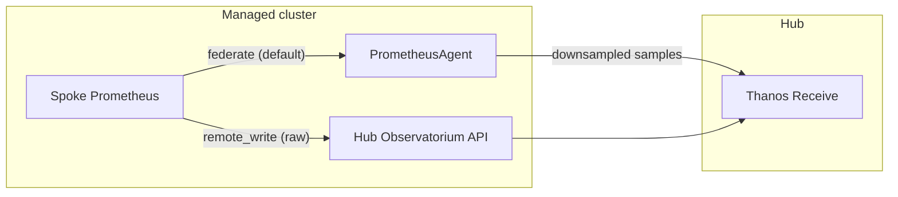

# Keep the 15-second view: raw metrics collection with ACM (not yet part of release)

Fleet metrics that only land every five minutes hide the thing you are paging on. A CPU throttle, a network micro-burst, a brief `up` flap — gone in the downsample.

Red Hat Advanced Cluster Management (ACM) Observability has always optimized for fleet scale: the MultiCluster Observability Addon (MCOA) federates from each managed-cluster Prometheus and sends a compact view to the hub. That is the right default. It is the wrong tool when you need the sample the local Prometheus actually scraped.

Raw metrics collection gives you that sample — without a new custom resource, and without turning every series in the fleet into high-resolution traffic.

## The problem federation creates at high resolution

MCOA’s PrometheusAgent scrapes the local Prometheus `/federate` endpoint and forwards what it gets. For most operators that is enough. The default resolution is five minutes.

Raise the resolution by shrinking the federation window and three things go wrong:

- The source Prometheus spends more CPU answering federate queries and can miss the window.
- You still lose fidelity relative to the native scrape.
- If native resolution is finer than the federation interval, you ship duplicates and out-of-order samples into Thanos Receive.

You asked Prometheus to do more work and still did not get the raw series.

## The solution: annotate, don’t rebuild the stack

Raw collection is opt-in per `ScrapeConfig` on the hub. Add:

```yaml
observability.open-cluster-management.io/resolution-strategy: "raw"
```

MCOA then **bypasses federation for that config** and remote-writes those series from the managed-cluster Prometheus to the hub Observatorium API.

Federation stays in place for everything else. One pipeline for the fleet overview. One pipeline for the series you actually need at native resolution.



### How it works

1. You keep using the same platform or user-workload `ScrapeConfig` labels you already use for MCOA.
2. The addon-manager retargets annotated configs (the component label gets a `-raw` suffix) so the PrometheusAgent **stops federating them**.
3. On the spoke, the endpoint operator turns `match[]` selectors into `writeRelabelConfigs` and patches remote-write onto Cluster Monitoring Operator (CMO) config — or, later, a Cluster Observability Operator (COO) `MonitoringStack`.
4. Grafana’s **Observatorium-Dynamic** datasource (30-second step) is the one to query. The legacy interval on `observabilityAddonSpec` does not apply to this path.

### Example ScrapeConfig

Target an existing platform or user-workload collector config, then annotate it:

```yaml
apiVersion: monitoring.rhobs/v1alpha1
kind: ScrapeConfig
metadata:
  name: platform-raw-metrics
  namespace: open-cluster-management-observability
  labels:
    app.kubernetes.io/component: platform-metrics-collector
  annotations:
    observability.open-cluster-management.io/resolution-strategy: "raw"
spec:
  params:
    match[]:
      - 'up{job=~"api.*"}'
      - 'container_memory_cache{container!="POD"}'
```

Use `app.kubernetes.io/component: user-workload-metrics-collector` for user-workload series.

To send those series to a COO stack instead of the default CMO user-workload Prometheus:

```yaml
metadata:
  annotations:
    observability.open-cluster-management.io/resolution-strategy: "raw"
    observability.open-cluster-management.io/coo-monitoring-stacks: "my-monitoring-ns/my-monitoring-stack"
```

## Why this matters

| You get | Because |
| --- | --- |
| Diagnosis of short-lived events | Samples arrive at native Prometheus resolution, not a 5-minute federate window. |
| Less load on spoke Prometheus | Federate is taken off the hot path for those series; remote-write is the scrape the server already did. |
| Selective cost | Only annotated `ScrapeConfig`s go raw. The rest of the fleet stays downsampled. |
| No new CRD | Activation is one annotation on an object operators already GitOps. |

That last point is the product choice: a dual pipeline, not a second control plane.

## What to plan for

**High-availability Prometheus doubles the write volume.** Each replica remote-writes with a `prometheus_replica` external label. Thanos Query and Compact on the hub deduplicate, but Receivers still see both streams. Size Thanos Receive — t-shirt sizes or per-component replicas on the `MultiClusterObservability` CR — before you annotate high-cardinality jobs.

**Spoke Prometheus may need more CPU and memory.** Remote-write is extra work on the source.

**COO targeting is limited today.** The supported path is CMO platform and user-workload config. If you point a raw `ScrapeConfig` at a Cluster Observability Operator `MonitoringStack`, MCOA remote-write entries can overwrite existing `remoteWrite` lists on that stack.

**Query the Dynamic datasource.** If dashboards still use the 5-minute Observatorium source, raw series will look like they never arrived.

## Try it

Do not flip the whole fleet to raw on day one. Start with **one narrow `ScrapeConfig`**, prove the pipeline, then widen.

### 1. Pick one diagnostic config — not the full allowlist

The default MCOA platform allowlist is a large set of fleet metrics (nodes, kube-state, API server, and so on). If you annotate *that* config, every series in it starts remote-writing at native scrape resolution. That is the fastest way to surprise Thanos Receive with cardinality and network.

Instead, create a **small extra** `ScrapeConfig` whose `match[]` list is only the series you need for a real incident, for example API server health:

```yaml
apiVersion: monitoring.rhobs/v1alpha1
kind: ScrapeConfig
metadata:
  name: platform-raw-apiserver-up
  namespace: open-cluster-management-observability
  labels:
    app.kubernetes.io/component: platform-metrics-collector
  annotations:
    observability.open-cluster-management.io/resolution-strategy: "raw"
spec:
  params:
    match[]:
      - 'up{job="apiserver"}'
```

Keep `app.kubernetes.io/component: platform-metrics-collector` (or `user-workload-metrics-collector`) so MCOA still owns the object. The annotation is what switches **this** config off federation and onto remote-write. Every other `ScrapeConfig` without the annotation stays on the 5-minute federate path.

### 2. Confirm series on Observatorium-Dynamic

Raw samples do **not** show up on the default Grafana **Observatorium** datasource. That source steps at the old collector interval (typically 5 minutes). Use **Observatorium-Dynamic** (30-second step).

In Explore, select Observatorium-Dynamic and run something as simple as:

```promql
up{job="apiserver"}
```

You should see points at native scrape cadence (often 15–30s on the spoke), with the usual ACM `cluster` / `clusterID` labels. If the query is empty on Dynamic but populated on the 5-minute source, you are looking at the federated copy, not the raw path.

### 3. Watch Receive CPU and network before you expand the matchers

Remote-write hits Thanos Receive on the hub and the spoke Prometheus that is doing the write. After the annotation is live, watch for a few scrape cycles:

- Hub: Thanos Receive CPU, memory, and ingest rate (`thanos_receive_*` / receive pod metrics).
- Hub: network bytes in on the Observatorium API / Receive path.
- Spoke: Prometheus CPU and WAL/remote-write queue if you have HA replicas (`prometheus_replica` doubles the volume).

If Receive is calm and the Dynamic query looks right, **then** add more matchers (`container_cpu_cfs_throttled_seconds_total`, a specific namespace, and so on) or a second `ScrapeConfig`. Do not start from `{__name__=~".+"}` or the full platform allowlist.

For the surrounding MCOA metrics workflow, see [Adding custom metrics with MCOA](https://docs.redhat.com/en/documentation/red_hat_advanced_cluster_management_for_kubernetes/2.17/html-single/observability/index#add-custom-metrics-mcoa) in the ACM Observability documentation.
